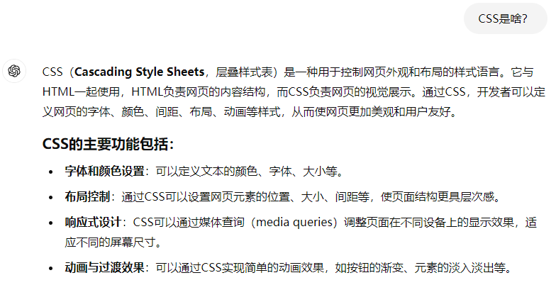

# HEU-thesis-Word-template

哈尔滨工程大学毕业论文模板


## 使用说明
1. dotx文件介绍与使用
[你真的会吗？Word 模板应该这样用](https://mp.weixin.qq.com/s/uqpu_mxocMIIDVYsMGM1nQ)

根据《哈尔滨工程大学2013届本科生毕业设计（论文）撰写规范》设定的 Word 模板，其实就是设定一些样式（比如 正文、章节标题、目录、参考文献什么的），起因是 Word 排版实际上成了我毕设中最有趣的的部分，因为我发现它跟写 CSS 一样，需要模块可复用，需要灵活可扩展，需要语义可维护，需要严格遵循 DRY 原则。

至于页眉什么的样式设定好了，但是要怎么添加章节名什么的随便搜下就出来了。

虽然是根据本科生的规范设定的，但是和研究生和博士生论文的规范相似度很高。


# word设置默认模板
### 步骤 1：找到 Normal.dotm 文件
`Normal.dotm` 文件是 Word 的默认模板，保存在系统的模板文件夹中。你可以按照以下路径找到它：
- **Windows 10/11**：
  - 打开 **文件资源管理器**，并在地址栏中输入以下路径，然后按下 **Enter**：
    ```
    %appdata%\Microsoft\Templates
    ```
  - 在此路径下，你会看到一个名为 **Normal.dotm** 的文件。

### 步骤 2：打开 Normal.dotm 文件
1. **打开 Word**。
2. 点击 **“文件”** 菜单，选择 **“打开”**。
3. 浏览到之前找到的模板文件夹，找到 **Normal.dotm** 文件，然后点击 **打开**。

### 步骤 3：编辑 Normal.dotm 文件
1. **更改格式**：
   - 你可以设置字体、段落格式、页边距、样式、页面布局等。
   - 例如：设置常用的字体为 **Times New Roman**，字号为 **12pt**，或者设置特定的页边距。
2. **添加内容**：
   - 如果你希望每个新文档都包含某些固定内容，比如页眉、页脚、特定样式表等，你可以在 Normal.dotm 中进行这些编辑。
3. **修改工具栏**：
   - 你可以自定义 Word 的工具栏和快捷方式，这些修改也会保存在模板中，使它们在每次打开新文档时可用。

### 步骤 4：保存 Normal.dotm 文件
1. 完成编辑后，点击 **“文件”**，然后选择 **“保存”**。
   - 注意：不要选择 **“另存为”**，因为我们需要覆盖原有的 `Normal.dotm` 文件，而不是创建新的文件。
2. 关闭模板文件。

### 步骤 5：测试新的默认模板
1. **关闭并重新打开 Word**。
2. 点击 **“新建”**，然后选择 **“空白文档”**。
   - 你应该会看到所有你在 `Normal.dotm` 中所做的更改已经生效。

### 提示
- **备份原始模板**：在你对 `Normal.dotm` 进行修改之前，建议先备份原始文件，以防出现问题时可以恢复。
  - 你可以复制 `Normal.dotm` 文件并将其保存到安全的地方。
- **恢复默认模板**：如果你想恢复默认设置，只需删除 `Normal.dotm` 文件，Word 会在下次启动时自动创建一个新的默认模板。

### 常见用途
- **常用字体和字号**：比如设置默认字体为 Arial，字号为 11pt。
- **页面设置**：例如设置默认的页边距、行距、纸张大小等。
- **页眉页脚**：为每个新文档添加固定的页眉和页脚，比如公司名称和联系方式。
- **快捷键和宏**：如果你经常使用某些功能，可以添加自定义快捷键或宏。

通过这些步骤，你就可以定制 Word 的默认模板，使每次新建的文档都符合你的个性化设置，极大地提高工作效率。
## Q:
1. CSS是什么东西？
2. DRY 原则是什么？
## A:
1. 
2. 